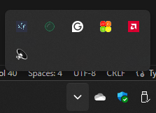

# Tray Module

### This can create new system tray icon
```ts
import { app, BrowserWindow, Tray } from "electron";
import path from "path";


let mainWindow: BrowserWindow;
app.on("ready", () => {
    new Tray(path.join(app.getAppPath(), "/electron.jpg"));
});
```

